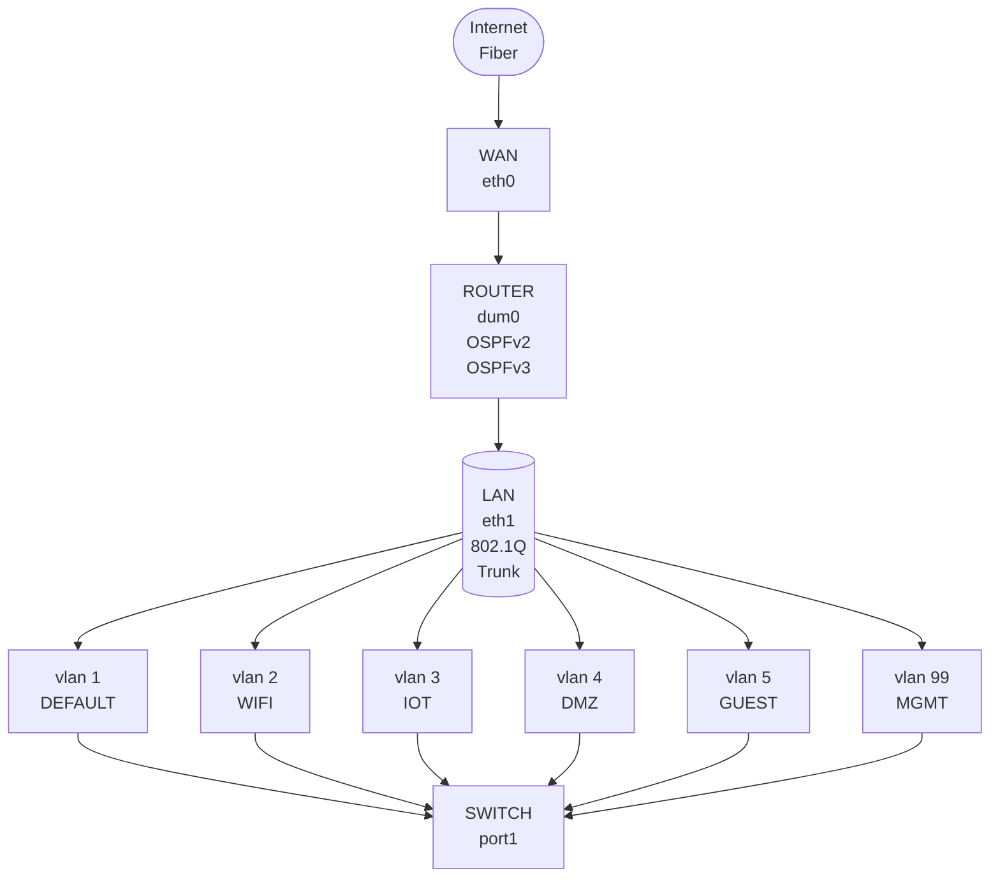

# ubuntu-gateway-router

Simple bash script to configure Ubuntu 26.04 LTS as a gateway router with dual-stack Internet Protocol (IP) networking, dynamic routing, and VLAN support while using software packages from the offical Ubuntu repositories and well-known services that scale.

## Requirements

- **Architecture:** 64-bit AMD/Intel based CPU or ARM based SOC
- **Processor:** 2.0 GHz 8-core CPU or SOC (or better)
- **Memory:** 8 GB RAM (or better)
- **Storage:** 32 GB SSD (or better)
- **Installer:** USB 3.0 [Type-A or Type-C] port (or better)
- **Network:** 2 x Ethernet [copper or fiber] adapters (or better)
- **Internet:** Used to install updates and additional software packages

> The hardware requirements listed above are intended to provide a comfortable user experience. As with most Unix-like operating systems, the hardware requirements for Ubuntu 26.04 LTS Server depend largely on the intended workload. Systems running a desktop environment and modern applications, such as web browsers, may benefit from 16 GB of RAM, regardless of the official minimum requirements for the Desktop edition.

## Developers

- Robert LaRocca @robertlarocca

## Contributors

- [Anthropic Claude Code](https://claude.ai/chat/f197f9f8-41b1-459b-92d7-3329e548bb36)

> [!NOTE]
> I'll build this as a full provisioning script. First let me check whether any bundled skill covers this kind of task. No skill covers shell scripting and network provisioning, so I'll write this directly. A few real bugs in the firewall section — nftables sets are per-table, and my SSH limiter would have blocked legitimate logins. Rewriting that section about 2,780 lines, idempotent, with a `--dry-run` mode that renders every config to `/tmp` and validates it without touching the system. I ran that mode here to shake out bugs.

## Overview

### Services

- **netplan:**WAN (DHCPv4 + accept-ra), a bare 802.1Q trunk, a `dum0` dummy for the router-id, and four VLAN sub-interfaces with static v4 + GUA + ULA
- **nftables:** one `inet` table for both families, `ip nat` for masquerade only (IPv6 is routed, not translated), anti-spoofing in the prerouting/raw hook, and a per-VLAN forwarding matrix generated from a `trusted/restricted/dmz/mgmt` zone class
- **kea:** DHCPv4 + stateful DHCPv6 + `kea-dhcp-ddns`, sharing a generated TSIG key with BIND so leases become A/AAAA/PTR records
- **bind:** validating recursive resolver bound only to internal addresses, plus authoritative forward and reverse zones (v4 /24s and the two v6 /48s, computed from your prefixes)
- **frr:** OSPFv2/v3 with adjacencies confined to the mgmt VLAN, and zebra's RA implementation instead of a separate radvd

### Network

### Defaults

The defaults settings use the `2001:db8::/32` IPv6 subnet, which is for documentation only and won't route. Swap with your real IPv6 prefix delegation assinged by Internet Service Proiver (ISP). If your ISP uses DHCPv6-PD rather than a static prefix, set `ENABLE_DHCPV6_PD=yes` which adds systemd-networkd drop-ins beside the netplan-generated units, but Kea `subnet6` blocks and FRR `ipv6 nd prefix` settings won't follow a changing prefix on their own; that needs a lease-change hook the script doesn't attempt.

I also can't verify package availability on Ubuntu 26.04 LTS Server — the version check warns rather than aborts, and `kea-common`/`frr-pythontools` names are worth confirming against the archive.

Applying netplan and nftables will interrupt the network, so run it from a console or the mgmt VLAN. It prompts before both.
